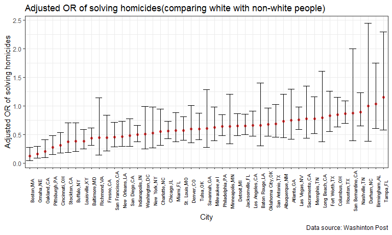

p8105\_hw6\_hh2767
================
Haoran Hu
2018-11-22

Problem 1
=========

Read and describe the dataset
-----------------------------

``` r

homicide = GET("https://raw.githubusercontent.com/washingtonpost/data-homicides/master/homicide-data.csv") %>% 
  content("raw") %>% 
  read_csv()
## Parsed with column specification:
## cols(
##   uid = col_character(),
##   reported_date = col_integer(),
##   victim_last = col_character(),
##   victim_first = col_character(),
##   victim_race = col_character(),
##   victim_age = col_character(),
##   victim_sex = col_character(),
##   city = col_character(),
##   state = col_character(),
##   lat = col_double(),
##   lon = col_double(),
##   disposition = col_character()
## )

str(homicide)
## Classes 'tbl_df', 'tbl' and 'data.frame':    52179 obs. of  12 variables:
##  $ uid          : chr  "Alb-000001" "Alb-000002" "Alb-000003" "Alb-000004" ...
##  $ reported_date: int  20100504 20100216 20100601 20100101 20100102 20100126 20100127 20100127 20100130 20100210 ...
##  $ victim_last  : chr  "GARCIA" "MONTOYA" "SATTERFIELD" "MENDIOLA" ...
##  $ victim_first : chr  "JUAN" "CAMERON" "VIVIANA" "CARLOS" ...
##  $ victim_race  : chr  "Hispanic" "Hispanic" "White" "Hispanic" ...
##  $ victim_age   : chr  "78" "17" "15" "32" ...
##  $ victim_sex   : chr  "Male" "Male" "Female" "Male" ...
##  $ city         : chr  "Albuquerque" "Albuquerque" "Albuquerque" "Albuquerque" ...
##  $ state        : chr  "NM" "NM" "NM" "NM" ...
##  $ lat          : num  35.1 35.1 35.1 35.1 35.1 ...
##  $ lon          : num  -107 -107 -107 -107 -107 ...
##  $ disposition  : chr  "Closed without arrest" "Closed by arrest" "Closed without arrest" "Closed by arrest" ...
##  - attr(*, "spec")=List of 2
##   ..$ cols   :List of 12
##   .. ..$ uid          : list()
##   .. .. ..- attr(*, "class")= chr  "collector_character" "collector"
##   .. ..$ reported_date: list()
##   .. .. ..- attr(*, "class")= chr  "collector_integer" "collector"
##   .. ..$ victim_last  : list()
##   .. .. ..- attr(*, "class")= chr  "collector_character" "collector"
##   .. ..$ victim_first : list()
##   .. .. ..- attr(*, "class")= chr  "collector_character" "collector"
##   .. ..$ victim_race  : list()
##   .. .. ..- attr(*, "class")= chr  "collector_character" "collector"
##   .. ..$ victim_age   : list()
##   .. .. ..- attr(*, "class")= chr  "collector_character" "collector"
##   .. ..$ victim_sex   : list()
##   .. .. ..- attr(*, "class")= chr  "collector_character" "collector"
##   .. ..$ city         : list()
##   .. .. ..- attr(*, "class")= chr  "collector_character" "collector"
##   .. ..$ state        : list()
##   .. .. ..- attr(*, "class")= chr  "collector_character" "collector"
##   .. ..$ lat          : list()
##   .. .. ..- attr(*, "class")= chr  "collector_double" "collector"
##   .. ..$ lon          : list()
##   .. .. ..- attr(*, "class")= chr  "collector_double" "collector"
##   .. ..$ disposition  : list()
##   .. .. ..- attr(*, "class")= chr  "collector_character" "collector"
##   ..$ default: list()
##   .. ..- attr(*, "class")= chr  "collector_guess" "collector"
##   ..- attr(*, "class")= chr "col_spec"
```

The raw dataset contains 12 variables and 52179 observations. It contains information about 52179 homicides occured in the US. The variables in this dataset are:

-   `uid`: homicide id
-   `reported_date`: reported date
-   `victim_last`: last name of victim
-   `victim_first`: first name of victim
-   `victim_race`: race of victim
-   `victim_age`: age of victim
-   `victim_sex`: sex of victim
-   `city`: city of the homicides
-   `state`: state of the homicides
-   `lat`: occurrence latitude
-   `lon`: occurence longitude
-   `disposition`: result of investigation

The location, time, and information of victims of each homicide are included in the dataset. The dataset also indicates whether the homicides are solved or not.

Adding variables and tidying the dataset
----------------------------------------

In the following part, I will:

-   create a `sity_state` variable which show the city and state of occurence

-   add a binary variable indicating whether the homicide is solved

-   omit cities Dallas, TX; Phoenix, AZ; Kansas City, MO; and Tulsa, AL

-   modifiy `victim_race` to have categories white and non-white, with white as the reference category

-   change `victim_age` to numeric variable

``` r
homicide = homicide %>% 
  mutate(city_state = str_c(city, ",", state),
         resolved = as.numeric(disposition == "Closed by arrest"),
         victim_race = as.factor(ifelse(victim_race == "White", "white", "non-white")),
         victim_race = relevel(victim_race, ref = "white"),
         victim_age = as.numeric(victim_age)
         ) %>%
  filter(!city_state %in% c("Dallas,TX", "Phoenix,AZ", "Kansas City,MO", "Tulsa,AL")) 
## Warning in evalq(as.numeric(victim_age), <environment>): 强制改变过程中产生
## 了NA

str(homicide)
## Classes 'tbl_df', 'tbl' and 'data.frame':    48507 obs. of  14 variables:
##  $ uid          : chr  "Alb-000001" "Alb-000002" "Alb-000003" "Alb-000004" ...
##  $ reported_date: int  20100504 20100216 20100601 20100101 20100102 20100126 20100127 20100127 20100130 20100210 ...
##  $ victim_last  : chr  "GARCIA" "MONTOYA" "SATTERFIELD" "MENDIOLA" ...
##  $ victim_first : chr  "JUAN" "CAMERON" "VIVIANA" "CARLOS" ...
##  $ victim_race  : Factor w/ 2 levels "white","non-white": 2 2 1 2 1 1 2 2 1 2 ...
##  $ victim_age   : num  78 17 15 32 72 91 52 52 56 43 ...
##  $ victim_sex   : chr  "Male" "Male" "Female" "Male" ...
##  $ city         : chr  "Albuquerque" "Albuquerque" "Albuquerque" "Albuquerque" ...
##  $ state        : chr  "NM" "NM" "NM" "NM" ...
##  $ lat          : num  35.1 35.1 35.1 35.1 35.1 ...
##  $ lon          : num  -107 -107 -107 -107 -107 ...
##  $ disposition  : chr  "Closed without arrest" "Closed by arrest" "Closed without arrest" "Closed by arrest" ...
##  $ city_state   : chr  "Albuquerque,NM" "Albuquerque,NM" "Albuquerque,NM" "Albuquerque,NM" ...
##  $ resolved     : num  0 1 0 1 0 0 1 1 0 0 ...
```

Logistic regression for Baltimore
---------------------------------

In this part, I will:

-   Focus on the city of Baltimore, MD

-   use the glm function to fit a logistic regression with resolved vs unresolved as the outcome and victim age, sex and race (as just defined) as predictors

-   save the output of glm as an R object

-   apply the `broom::tidy` to this object; and obtain the estimate and confidence interval of the adjusted odds ratio for solving homicides comparing non-white victims to white victims keeping all other variables fixed

``` r
baltimore_logistic = 
  homicide %>% 
  filter(city == "Baltimore") %>%
  glm(resolved ~ victim_age + victim_race + victim_sex, data = ., family = binomial())


baltimore_race_OR = baltimore_logistic %>% 
  broom::tidy() %>% 
  mutate(OR = exp(estimate)) %>% 
  cbind(., 
        exp(baltimore_logistic %>% 
  broom::confint_tidy())) %>% 
  filter(term == "victim_racenon-white") %>% 
  mutate(city = "Baltimore, MD") %>% 
  select(city,term, OR, '95% conf.low' = conf.low, '95% conf.high' = conf.high) 

baltimore_race_OR %>% 
  knitr::kable(digits = 3)
```

| city          | term                  |     OR|  95% conf.low|  95% conf.high|
|:--------------|:----------------------|------:|-------------:|--------------:|
| Baltimore, MD | victim\_racenon-white |  0.441|         0.312|           0.62|

The table above shows the estimate and confidence interval of the adjusted odds ratio for solving homicides comparing non-white victims to white victims keeping all other variables fixed. The estimated adjusted odds ratio is 0.441, which means that the murdered non-white people have 0.441 times the odds of having the homicide solved when compared with white people. The 95% confidence interval for the adjusted OR is \[0.312, 0.62\]

Apply the process described above to each city
----------------------------------------------

In this part, I will:

-   build a function to run glm for each of the cities in the dataset

-   extract the adjusted odds ratio (and CI) for solving homicides comparing non-white victims to white victims

-   making use of purrr::map, list columns, and unnest

``` r
get_or_race = function(city_data){
  
  city_logistic = 
  city_data %>% 
  glm(resolved ~ victim_age + victim_race + victim_sex, data = ., family = binomial())

  city_race_OR = city_logistic %>% 
  broom::tidy() %>% 
  mutate(OR = exp(estimate)) %>% 
  cbind(., 
        exp(city_logistic %>% 
  broom::confint_tidy())) %>% 
  filter(term == "victim_racenon-white") %>% 
  select(`adjusted OR for solving homicides` = OR, '95% conf.low' = conf.low, '95% conf.high' = conf.high) 
  
  round(city_race_OR, 3)
}


homicide_race_or = homicide %>% 
  filter(victim_sex != "Unknown") %>% 
  select(city_state, victim_age, victim_race, victim_sex, resolved) %>% 
  group_by(city_state) %>% 
  nest() %>% 
  mutate(or_race = map(data, ~get_or_race(.x))) %>% 
  select(-data) %>% 
  unnest()

str(homicide_race_or)
## Classes 'tbl_df', 'tbl' and 'data.frame':    47 obs. of  4 variables:
##  $ city_state                       : chr  "Albuquerque,NM" "Atlanta,GA" "Baltimore,MD" "Baton Rouge,LA" ...
##  $ adjusted OR for solving homicides: num  0.738 0.753 0.441 0.668 1.039 ...
##  $ 95% conf.low                     : num  0.447 0.424 0.312 0.304 0.612 0.047 0.21 0.313 0.432 0.18 ...
##  $ 95% conf.high                    : num  1.21 1.3 0.62 1.4 1.75 ...
```

The data frame `homicide_race_or` contains estimated ORs and CIs for each city.

Making a plot to show the estimated ORs and CIs
-----------------------------------------------

Next, I will make a plot to show the estimated ORs and CIs for each city

``` r

homicide_race_or %>% 
  mutate(city_state = forcats::fct_reorder(city_state, `adjusted OR for solving homicides`)) %>% 
  ggplot(.) +
  geom_point(aes(x = city_state, y =  `adjusted OR for solving homicides`), color = "brown1") +
  geom_errorbar( aes(x = city_state, ymin = `95% conf.low`, ymax = `95% conf.high`)) +
  labs(title = "Adjusted OR of solving homicides(comparing white with non-white people)", x = "City", y = "Adjusted OR of solving homicides") +
  theme(axis.text.x = element_text(face = "plain", color = "black", size = 6.5, angle = 90), legend.position = "null")
```



Problem2
========

Loading and cleaning the data
-----------------------------

``` r
birthweight = GET("http://p8105.com/data/birthweight.csv") %>% 
  content("raw") %>% 
  read_csv()
## Parsed with column specification:
## cols(
##   .default = col_integer(),
##   gaweeks = col_double(),
##   ppbmi = col_double(),
##   smoken = col_double()
## )
## See spec(...) for full column specifications.

birthweight_model = 
  birthweight %>% 
  mutate(babysex = factor(babysex, levels = c(1, 2), labels = c("male", "female")),
         frace = factor(frace, levels = c(1, 2, 3, 4, 8, 9), labels = c("white", "black", "asian", "puerto tican", "other", "unknown")),
         mrace = factor(mrace, levels = c(1, 2, 3, 4, 8), labels = c("white", "black", "asian", "puerto tican", "other")),
         malform = factor(malform, labels = c("absent", "present")))


str(birthweight_model)
## Classes 'tbl_df', 'tbl' and 'data.frame':    4342 obs. of  20 variables:
##  $ babysex : Factor w/ 2 levels "male","female": 2 1 2 1 2 1 2 2 1 1 ...
##  $ bhead   : int  34 34 36 34 34 33 33 33 36 33 ...
##  $ blength : int  51 48 50 52 52 52 46 49 52 50 ...
##  $ bwt     : int  3629 3062 3345 3062 3374 3374 2523 2778 3515 3459 ...
##  $ delwt   : int  177 156 148 157 156 129 126 140 146 169 ...
##  $ fincome : int  35 65 85 55 5 55 96 5 85 75 ...
##  $ frace   : Factor w/ 6 levels "white","black",..: 1 2 1 1 1 1 2 1 1 2 ...
##  $ gaweeks : num  39.9 25.9 39.9 40 41.6 ...
##  $ malform : Factor w/ 2 levels "absent","present": 1 1 1 1 1 1 1 1 1 1 ...
##  $ menarche: int  13 14 12 14 13 12 14 12 11 12 ...
##  $ mheight : int  63 65 64 64 66 66 72 62 61 64 ...
##  $ momage  : int  36 25 29 18 20 23 29 19 13 19 ...
##  $ mrace   : Factor w/ 5 levels "white","black",..: 1 2 1 1 1 1 2 1 1 2 ...
##  $ parity  : int  3 0 0 0 0 0 0 0 0 0 ...
##  $ pnumlbw : int  0 0 0 0 0 0 0 0 0 0 ...
##  $ pnumsga : int  0 0 0 0 0 0 0 0 0 0 ...
##  $ ppbmi   : num  26.3 21.3 23.6 21.8 21 ...
##  $ ppwt    : int  148 128 137 127 130 115 105 119 105 145 ...
##  $ smoken  : num  0 0 1 10 1 0 0 0 0 4 ...
##  $ wtgain  : int  29 28 11 30 26 14 21 21 41 24 ...
```

Now, the dataset we get is a 4342 (observation) \* 20 (variables) dataset, the variables are:

-   `babysex`: baby's sex (male, female)

-   `bhead`: baby's head circumference at birth (centimeters)

-   `blength`: baby's length at birth (centimeteres)

-   `bwt`: baby's birth weight (grams)

-   `delwt`: mother's weight at delivery (pounds)

-   `fincome`: family monthly income (in hundreds, rounded)

-   `frace`: father's race (White, Black, Asian, Puerto Rican, Other, Unknown)

-   `gaweeks`: gestational age in weeks

-   `malform`: presence of malformations that could affect weight (absent, present)

-   `menarche`: mother's age at menarche (years)

-   `mheigth`: mother's height (inches)

-   `momage`: mother's age at delivery (years)

-   `mrace`: mother's race (White, Black, Asian, Puerto Rican, Other)

-   `parity`: number of live births prior to this pregnancy

-   `pnumlbw`: previous number of low birth weight babies

-   `pnumgsa`: number of prior small for gestational age babies

-   `ppbmi`: mother's pre-pregnancy BMI

-   `ppwt`: mother's pre-pregnancy weight (pounds)

-   `smoken`: average number of cigarettes smoked per day during pregnancy

-   `wtgain`: mother's weight gain during pregnancy (pounds)

Next, I will check the distribution of the outcome(birthweight).

``` r
birthweight_model %>% 
  ggplot(aes(x = bwt)) + 
  geom_histogram() + 
  labs( x = "Birthweight (grams)")
## `stat_bin()` using `bins = 30`. Pick better value with `binwidth`.
```


As the plot shows, birthweight is approximately normally distributed, and we don't need to do transformation on it.

Selecting predictors for the model
----------------------------------

First, we check the collinearity between the varibles and drop some of the correlated variables.

``` r
birthweight %>% 
  cor() %>% 
  knitr::kable(digits = 2)
```

|          |  babysex|  bhead|  blength|    bwt|  delwt|  fincome|  frace|  gaweeks|  malform|  menarche|  mheight|  momage|  mrace|  parity|  pnumlbw|  pnumsga|  ppbmi|   ppwt|  smoken|  wtgain|
|----------|--------:|------:|--------:|------:|------:|--------:|------:|--------:|--------:|---------:|--------:|-------:|------:|-------:|--------:|--------:|------:|------:|-------:|-------:|
| babysex  |     1.00|  -0.17|    -0.11|  -0.09|  -0.02|    -0.02|   0.03|     0.02|    -0.02|     -0.01|     0.01|   -0.04|   0.04|    0.02|       NA|       NA|  -0.01|   0.00|   -0.03|   -0.03|
| bhead    |    -0.17|   1.00|     0.63|   0.75|   0.21|     0.12|  -0.10|     0.38|     0.00|      0.00|     0.12|    0.11|  -0.11|   -0.02|       NA|       NA|   0.09|   0.14|   -0.05|    0.18|
| blength  |    -0.11|   0.63|     1.00|   0.74|   0.23|     0.08|  -0.11|     0.36|    -0.01|     -0.02|     0.16|    0.08|  -0.13|   -0.03|       NA|       NA|   0.07|   0.15|   -0.07|    0.19|
| bwt      |    -0.09|   0.75|     0.74|   1.00|   0.29|     0.15|  -0.18|     0.41|     0.00|     -0.02|     0.19|    0.14|  -0.21|   -0.01|       NA|       NA|   0.09|   0.18|   -0.08|    0.25|
| delwt    |    -0.02|   0.21|     0.23|   0.29|   1.00|     0.03|  -0.06|     0.12|     0.01|     -0.09|     0.41|    0.07|  -0.09|    0.00|       NA|       NA|   0.72|   0.87|    0.05|    0.42|
| fincome  |    -0.02|   0.12|     0.08|   0.15|   0.03|     1.00|  -0.28|     0.11|    -0.01|      0.00|     0.13|    0.32|  -0.30|   -0.03|       NA|       NA|  -0.02|   0.05|    0.08|   -0.02|
| frace    |     0.03|  -0.10|    -0.11|  -0.18|  -0.06|    -0.28|   1.00|    -0.11|    -0.03|      0.02|    -0.20|   -0.19|   0.83|    0.00|       NA|       NA|   0.05|  -0.06|   -0.17|   -0.02|
| gaweeks  |     0.02|   0.38|     0.36|   0.41|   0.12|     0.11|  -0.11|     1.00|    -0.01|      0.00|     0.06|    0.11|  -0.13|   -0.08|       NA|       NA|   0.03|   0.06|    0.04|    0.15|
| malform  |    -0.02|   0.00|    -0.01|   0.00|   0.01|    -0.01|  -0.03|    -0.01|     1.00|     -0.01|    -0.01|    0.02|  -0.03|    0.00|       NA|       NA|   0.00|   0.00|    0.03|    0.03|
| menarche |    -0.01|   0.00|    -0.02|  -0.02|  -0.09|     0.00|   0.02|     0.00|    -0.01|      1.00|     0.07|    0.18|   0.01|    0.02|       NA|       NA|  -0.12|  -0.07|    0.02|   -0.04|
| mheight  |     0.01|   0.12|     0.16|   0.19|   0.41|     0.13|  -0.20|     0.06|    -0.01|      0.07|     1.00|    0.11|  -0.23|   -0.01|       NA|       NA|  -0.10|   0.43|    0.06|    0.05|
| momage   |    -0.04|   0.11|     0.08|   0.14|   0.07|     0.32|  -0.19|     0.11|     0.02|      0.18|     0.11|    1.00|  -0.21|    0.05|       NA|       NA|   0.08|   0.13|    0.08|   -0.09|
| mrace    |     0.04|  -0.11|    -0.13|  -0.21|  -0.09|    -0.30|   0.83|    -0.13|    -0.03|      0.01|    -0.23|   -0.21|   1.00|    0.00|       NA|       NA|   0.03|  -0.08|   -0.20|   -0.03|
| parity   |     0.02|  -0.02|    -0.03|  -0.01|   0.00|    -0.03|   0.00|    -0.08|     0.00|      0.02|    -0.01|    0.05|   0.00|    1.00|       NA|       NA|  -0.01|  -0.01|   -0.01|    0.01|
| pnumlbw  |       NA|     NA|       NA|     NA|     NA|       NA|     NA|       NA|       NA|        NA|       NA|      NA|     NA|      NA|        1|       NA|     NA|     NA|      NA|      NA|
| pnumsga  |       NA|     NA|       NA|     NA|     NA|       NA|     NA|       NA|       NA|        NA|       NA|      NA|     NA|      NA|       NA|        1|     NA|     NA|      NA|      NA|
| ppbmi    |    -0.01|   0.09|     0.07|   0.09|   0.72|    -0.02|   0.05|     0.03|     0.00|     -0.12|    -0.10|    0.08|   0.03|   -0.01|       NA|       NA|   1.00|   0.85|    0.01|   -0.11|
| ppwt     |     0.00|   0.14|     0.15|   0.18|   0.87|     0.05|  -0.06|     0.06|     0.00|     -0.07|     0.43|    0.13|  -0.08|   -0.01|       NA|       NA|   0.85|   1.00|    0.04|   -0.07|
| smoken   |    -0.03|  -0.05|    -0.07|  -0.08|   0.05|     0.08|  -0.17|     0.04|     0.03|      0.02|     0.06|    0.08|  -0.20|   -0.01|       NA|       NA|   0.01|   0.04|    1.00|    0.03|
| wtgain   |    -0.03|   0.18|     0.19|   0.25|   0.42|    -0.02|  -0.02|     0.15|     0.03|     -0.04|     0.05|   -0.09|  -0.03|    0.01|       NA|       NA|  -0.11|  -0.07|    0.03|    1.00|

As the result shows, the correlation between `pnumlbw` and `pnumsga`, and other variables are not computed. That's probably because the values of the two variables are always zero in the dataset. Therefore, the two variables do not provide any information to us, and we exclude them from the dataset.

In addition, two sets of predictors have high correlations:

1.  `bhead` and `blength`

2.  `delwt` and `ppwt` and `ppbmi`

In the first set, I will keep `bhead` because it has higher correlation with `bwt`. In the second set, I will keep `ppbmi` because it integrates information on `ppwt` and `mheight`. In this case, we can also drop `mheight`because the information is contained in `ppbmi`.

After searching for some information from the internet, I found there are evidence that presence of malformations of the mother, number of live births prior to this pregnancy of the mother, mother's age at menarche, and mother's age are not closely relevant to baby's weight. Therefore, I will further exclude `malform`, `menarche`, `momage`, and `parity`, and keep the rest of variables in the model.

We call it Model 1.

Model 1:

bet ~ `babysex` + `bhead` + `fincome` + `frace` + `gaweeks` + `mrace` + `ppbmi` + `smoken` + `wtgain`

Fitting and describing the model
--------------------------------

``` r
birthweight_fit1 = lm(bwt ~ babysex + bhead + blength + fincome +frace + gaweeks + mrace + ppbmi + smoken + wtgain, data = birthweight_model)

summary(birthweight_fit1) 
## 
## Call:
## lm(formula = bwt ~ babysex + bhead + blength + fincome + frace + 
##     gaweeks + mrace + ppbmi + smoken + wtgain, data = birthweight_model)
## 
## Residuals:
##      Min       1Q   Median       3Q      Max 
## -1067.40  -188.89    -5.52   179.21  2412.85 
## 
## Coefficients:
##                     Estimate Std. Error t value Pr(>|t|)    
## (Intercept)       -5762.1380   101.3324 -56.864  < 2e-16 ***
## babysexfemale        31.8155     8.5037   3.741 0.000185 ***
## bhead               131.8856     3.4694  38.014  < 2e-16 ***
## blength              76.6166     2.0203  37.924  < 2e-16 ***
## fincome               0.4254     0.1756   2.423 0.015433 *  
## fraceblack           23.5905    46.3981   0.508 0.611173    
## fraceasian           24.7155    69.7007   0.355 0.722910    
## fracepuerto tican   -48.3443    44.9394  -1.076 0.282092    
## fraceother           -4.9010    74.5265  -0.066 0.947570    
## gaweeks              11.0894     1.4676   7.556 5.04e-14 ***
## mraceblack         -162.3067    46.2902  -3.506 0.000459 ***
## mraceasian         -112.1900    72.1990  -1.554 0.120282    
## mracepuerto tican   -86.4982    45.2208  -1.913 0.055840 .  
## ppbmi                 7.0898     1.3389   5.295 1.25e-07 ***
## smoken               -4.6188     0.5895  -7.836 5.83e-15 ***
## wtgain                4.1197     0.3949  10.433  < 2e-16 ***
## ---
## Signif. codes:  0 '***' 0.001 '**' 0.01 '*' 0.05 '.' 0.1 ' ' 1
## 
## Residual standard error: 274.2 on 4326 degrees of freedom
## Multiple R-squared:  0.7143, Adjusted R-squared:  0.7133 
## F-statistic:   721 on 15 and 4326 DF,  p-value: < 2.2e-16
```

The summary of the linear regression model is as above. The adjusted R-square is 0.7133 and that means the model fits well.

``` r
birthweight_model %>% 
  modelr::add_predictions(birthweight_fit1) %>% 
  modelr::add_residuals(birthweight_fit1) %>% 
  ggplot(aes(x = pred, y = resid)) + 
  geom_point() + 
  geom_smooth(se = FALSE) + 
  labs(title = "Fitted values vs. residuals plot", 
       x = "Fitted value", 
       y = "Model residual")
## `geom_smooth()` using method = 'gam' and formula 'y ~ s(x, bs = "cs")'
```


As the plot shows, when fitted value is above 2000 grams, which is the most common range of fitted values, the equal variance assumption of residuals holds true. When fitted value is below 2000 grams, the equal variance assumption seems to be violated, but that's because there are not many data points in that range, and the smooth curve might be driven off by those outliers. Therefore, in general, the plot does not reject the validity of the model.

Comparing the model with two others
-----------------------------------
